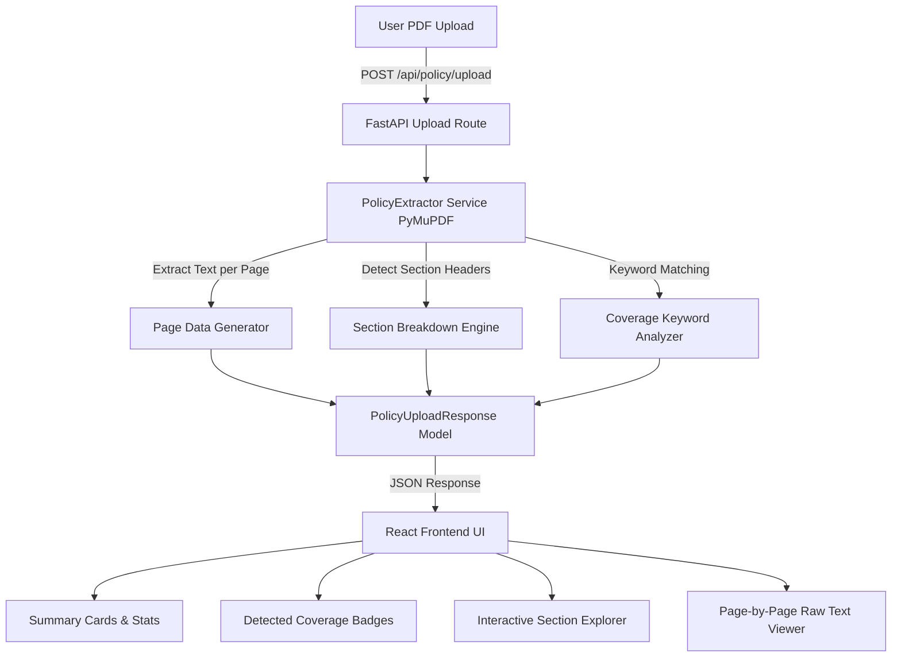

# Phase 1 Walkthrough — Policy Upload & Page-Aware Text Extraction

> **Policy-to-Patient** · Insurance Coverage & Treatment Cost Intelligence  
> HackMatrix 5.0 · Finance Track · FIN-01

---

## 🎯 Phase 1 Objective

The goal of **Phase 1** is to enable users to upload real health insurance policy PDFs (e.g., Niva Bupa, Star Health, HDFC ERGO, Care Health) and automatically extract:
1. **Page-by-page text content**
2. **Page-aware policy sections and headings**
3. **Detected key policy terms** (Room Rent, Waiting Periods, Co-payment, No Claim Bonus, AYUSH, Day Care, Restoration, etc.)
4. **Interactive exploration UI** in the frontend allowing text searching, section inspection, and raw page text viewing.

---

## 🏗️ Architecture & Component Overview



---

## 🛠️ Step-by-Step Implementation Summary

### 1. Backend Service (`backend/app/services/pdf_extractor.py`)
- **PyMuPDF Integration**: Opens and processes PDF byte streams without needing temporary disk files.
- **Section Parsing**: Identifies numbered sections, uppercase headers, and standard insurance policy clause titles.
- **Keyword Detection**: Scans extracted text for key terms:
  - `room_rent`: Room rent, ICU charges, capping
  - `pre_post_hospitalization`: Pre & post hospitalization days
  - `waiting_period`: Initial, specific disease, and PED waiting periods
  - `copay`: Co-payment percentages
  - `no_claim_bonus`: NCB and cumulative bonus
  - `ayush`: AYUSH / alternative treatments
  - `day_care`: Day care treatment coverage
  - `restoration`: Reinstatement / recharge options

### 2. FastAPI Endpoint (`backend/app/api/routes.py`)
- **Route**: `POST /api/policy/upload`
- Accepts `UploadFile` (multipart/form-data).
- Validates file type (`.pdf`) and ensures file is non-empty.
- Returns structured `PolicyUploadResponse` containing section previews, character counts, and page breakdown.

### 3. Frontend Interactive UI (`frontend/src/pages/PolicyAnalysisPage.tsx`)
- **Drag-and-Drop Dropzone**: Supports file picker and visual drag & drop.
- **Loading State**: Displays spinner and extraction steps during processing.
- **Status & Metrics Bar**: Displays total pages, section count, and total character count.
- **Detected Term Badges**: Color-coded badges indicating detected policy coverage terms.
- **Dual View Modes**:
  - **Sections Tab**: Searchable list of extracted sections with live text preview, page badges, and full section reader.
  - **Raw Page Text Tab**: Dropdown selector to view raw extracted text for any specific page.

---

## 🚀 How to Try the Walkthrough

### Step 1: Start the Backend and Frontend Servers

Open two PowerShell windows:

**Terminal 1 (Backend)**:
```powershell
cd backend
.\venv\Scripts\python.exe -m uvicorn app.main:app --reload --port 8000
```

**Terminal 2 (Frontend)**:
```powershell
cd frontend
npm run dev
```

### Step 2: Open the Application in Browser
Navigate to `http://localhost:5173/policy` in your web browser.

### Step 3: Upload a Health Insurance Policy PDF
- Click on **"Click to upload or drag & drop policy PDF"** or drag `data/policies/policy_wording.pdf`.
- The system will process the document using PyMuPDF.

### Step 4: Explore Extracted Structure
1. **Summary Metrics**: Observe the extracted **69 Pages**, **16 Sections**, and **173,849 Characters**.
2. **Coverage Term Badges**: See green checkmarks for detected clauses (Room Rent, Waiting Period, Co-pay, etc.).
3. **Search Sections**: Type `waiting` or `exclusion` in the section search box to filter clauses in real time.
4. **View Page-by-Page**: Switch to the **Page-by-Page Raw Text** tab and select page `1`, `10`, or `25` to inspect exact raw text.

---

## 🧪 Verification & Test Results

- **Backend PyTest Suite**:
  ```powershell
  cd backend
  .\venv\Scripts\pytest
  ```
  *Output:* `3 passed in 1.31s` (Success uploading sample PDF, rejection of non-PDF files, handling of empty PDFs).

- **Frontend Type Safety**:
  ```powershell
  cd frontend
  npx tsc --noEmit
  ```
  *Output:* `0 errors`.

---

## ⏭️ Ready for Phase 2: AI & Retrieval (RAG)

With Phase 1 complete, the application now has a reliable engine to extract page-aware sections from any policy PDF. Phase 2 will build upon this by chunking these extracted sections, generating vector embeddings, and enabling natural language Q&A with exact policy section citations.
