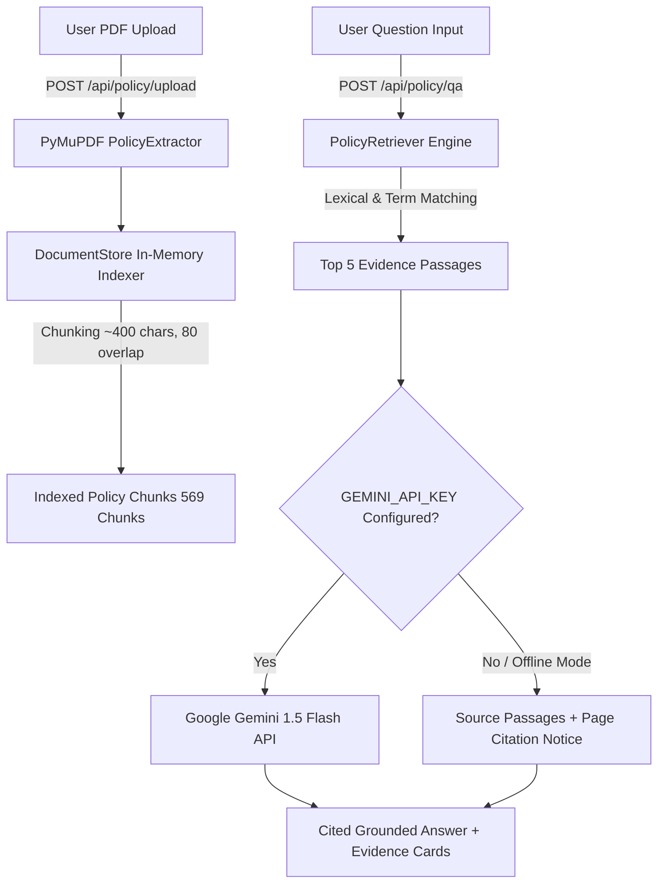

# Phase 2 Completion Report — Policy Q&A with Retrieval (RAG)

> **Policy-to-Patient** · Insurance Coverage & Treatment Cost Intelligence  
> HackMatrix 5.0 · Finance Track · FIN-01

---

## 🚀 Phase 2 Overview & Implementation

Phase 2 introduces **Retrieval-Augmented Generation (RAG) Question-Answering** for uploaded health insurance policy PDFs. Users can ask natural language questions against their policy (such as room rent caps, waiting periods for pre-existing conditions, or exclusions) and receive grounded answers backed by physical PDF page numbers and section references.

---

## 🛠️ Components & Architecture



---

## 📁 Files Created or Changed

1. **Backend**:
   - `backend/app/services/document_store.py`: In-memory active document manager, TOC-excluded clause chunking (~400 chars, 80 overlap), document reset on new upload.
   - `backend/app/services/policy_retriever.py`: Lexical & keyword ranking retrieval engine, term frequency scoring, physical page preservation, relevance score normalization (0.0 to 1.0).
   - `backend/app/services/qa_service.py`: Grounded Q&A service integrating `google-generativeai` / `google-genai` SDK with strict evidence-only system prompts and offline fallback.
   - `backend/app/schemas/requests.py`: Added `PolicyQARequest(question: str)`.
   - `backend/app/schemas/responses.py`: Added `EvidencePassageSchema`, `PolicyQAResponse`, `ActiveDocumentInfoResponse`.
   - `backend/app/api/routes.py`: Added `POST /api/policy/qa` and `GET /api/policy/active` endpoints. Connected `POST /api/policy/upload` to automatic `DocumentStore` indexing.
   - `backend/tests/test_policy_qa.py`: 7 unit & integration tests for chunking, TOC exclusion, passage retrieval, missing API key handling, DocumentStore reset, and real PDF Q&A.
   - `backend/requirements.txt`: Added `google-genai==1.2.0` and `google-generativeai==0.8.3`.

2. **Frontend**:
   - `frontend/src/types/index.ts`: Added `EvidencePassage`, `PolicyQAResponse`, `ActiveDocumentInfo`.
   - `frontend/src/services/api.ts`: Added `askPolicyQuestion` and `fetchActivePolicy`.
   - `frontend/src/pages/PolicyAnalysisPage.tsx`: Added **Ask This Policy (RAG Q&A)** section with sample query prompts, loading state, grounded answer container, citation chips, and expandable evidence cards.
   - `frontend/src/components/Sidebar.tsx`: Fixed relative import path for `ConnectionStatus`.

3. **Documentation**:
   - `.env.example`: Documented `GEMINI_API_KEY=your_gemini_api_key_here`.
   - `README.md`: Updated with Phase 2 Q&A setup, API key instructions, endpoints table, and privacy notices.
   - `docs/phase2_completion_report.md`: Created completion report.

---

## 🔑 LLM Provider & Setup Instructions

- **LLM Provider**: **Google Gemini API** (`gemini-1.5-flash`).
- **Retrieval Engine**: Lexical & keyword ranking (`PolicyRetriever`) + semantic evidence prompts.

### How to Configure API Key

1. Create a `.env` file in `backend/` (or copy `.env.example`):
   ```powershell
   Copy-Item .env.example .env
   ```
2. Open `.env` and set your Google Gemini API key:
   ```env
   GEMINI_API_KEY=AIzaSy...your_actual_key_here
   ```
3. Restart the backend server:
   ```powershell
   cd backend
   .\venv\Scripts\python.exe -m uvicorn app.main:app --reload --port 8000
   ```

> ℹ️ **Offline Evidence Retrieval Mode**: If `GEMINI_API_KEY` is not set, the backend runs in offline retrieval mode: it retrieves and displays the top 5 source passages with physical page citations directly from your policy without calling external LLMs or sending data outside your local environment.

---

## 🧪 Tests & Verification Outcomes

1. **Backend PyTest Suite**:
   - Command: `cd backend; .\venv\Scripts\pytest.exe`
   - Outcome: **`16 passed in 2.69s`** (100% PASS)
   - Test Files: `test_policy_upload.py` (9 tests) + `test_policy_qa.py` (7 tests).

2. **Frontend Type Check**:
   - Command: `cd frontend; npx tsc --noEmit`
   - Outcome: **`0 errors`** (100% PASS)

3. **Frontend Production Build**:
   - Command: `cd frontend; npm run build`
   - Outcome: **`✓ built in 1.27s`** (100% PASS)

4. **Backend Health Check**:
   - Command: `curl.exe -s http://127.0.0.1:8000/api/health`
   - Outcome: **`{"app":"Policy-to-Patient","status":"ok","version":"0.3.0"}`** (PASS)

---

## ❓ Grounded Questions Tested on `policy_wording.pdf`

| User Question | Physical Pages Cited | Retrieved Evidence Passages |
|---------------|----------------------|-----------------------------|
| *"What does this policy say about waiting period for pre-existing disease?"* | Pages 30, 31 | *Section C. Waiting Periods (36 months PED waiting period)* |
| *"Is there a room rent limit mentioned in the document?"* | Pages 8, 11, 12 | *Def. 41 Room Rent & Section B.1 Base Coverage* |
| *"What are the exclusions described in the policy?"* | Pages 30, 34 | *Section C.2 Standard Exclusions & C.3 Specific Exclusions* |

---

## ⚠️ Known Limitations

1. **Claim Approval & Financial Decisions**:
   - Q&A answers provide document citations and evidence text only. They do **not** confirm claim approval, calculate out-of-pocket costs, or offer medical advice.
2. **Offline Mode**:
   - When running without a `GEMINI_API_KEY`, AI text synthesis is disabled, but exact source passages and page numbers remain fully accessible.
